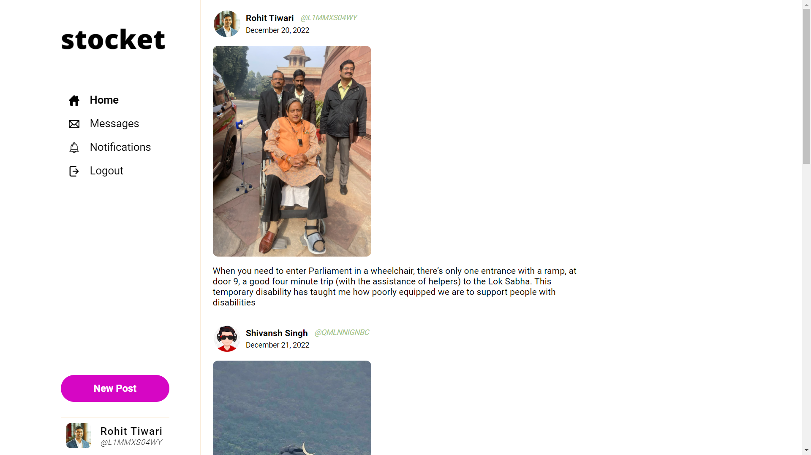
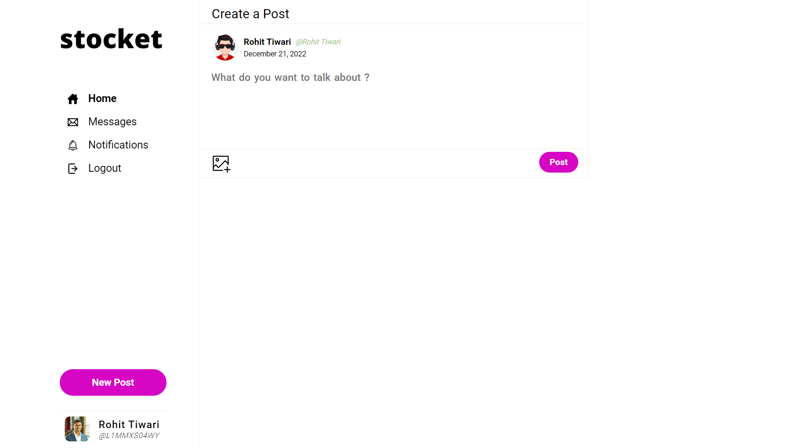
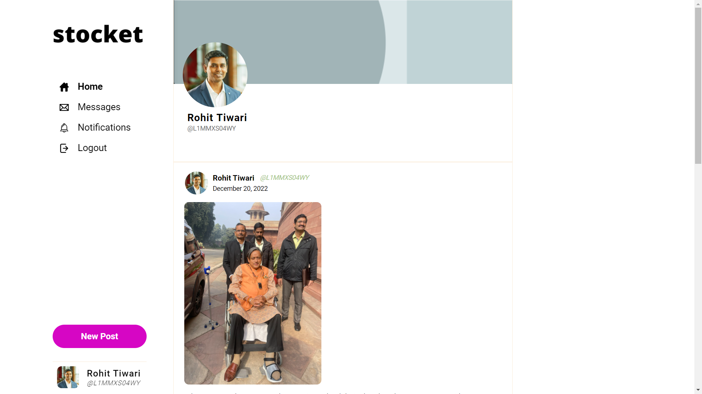
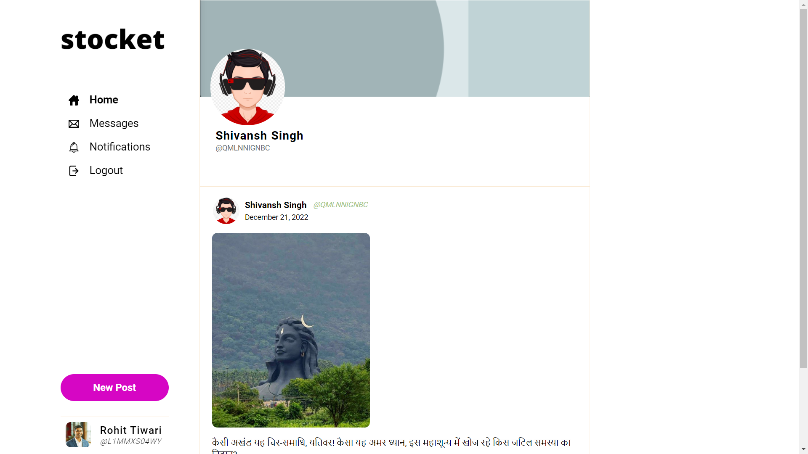
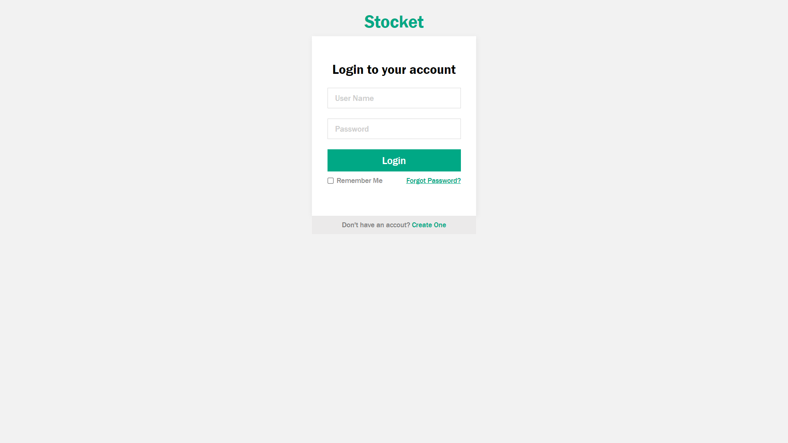
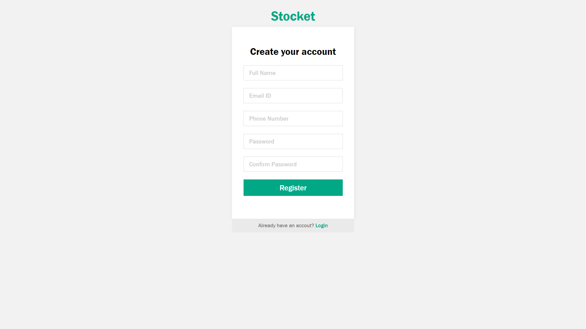

# **Social-Media-web-Application**
A Social Media Web Application Implemented on Flask on which user can post their daily lives and connect with the rest the world

<a href="https://youtu.be/Qloxr1yF-qI">Demo link</a>

## **Home**

 
 
 

## **Create New Post**

 
 
 

## **Profile User 1**

 
 
 

## **Profile User 2**

 
 
 

## **Login**

 
 
 

## **Registration**

 
 

## 🔗 Links

